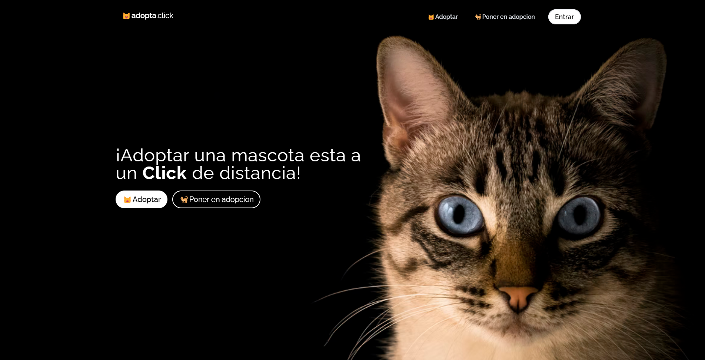
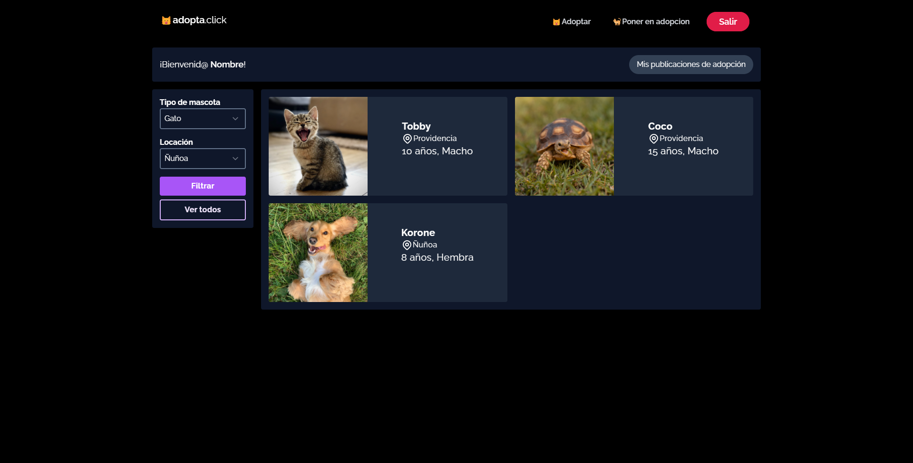
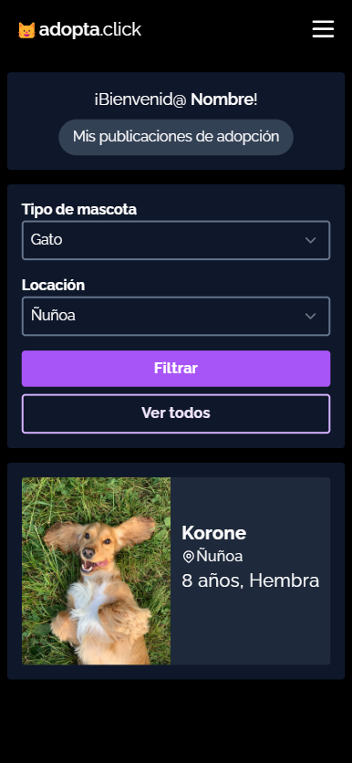

# Adopta.click

## Installation

Inside the project folder run:

```
py -m pipenv shell
py server.py
```

## Tech Stack

- Python with Flask
- Tailwind CSS
- MySQL as the data base
- AOS Library for Scroll animations

<!-- 

|           Desktop            |           Mobile            |
| :--------------------------: | :-------------------------: |
|  |  | -->
